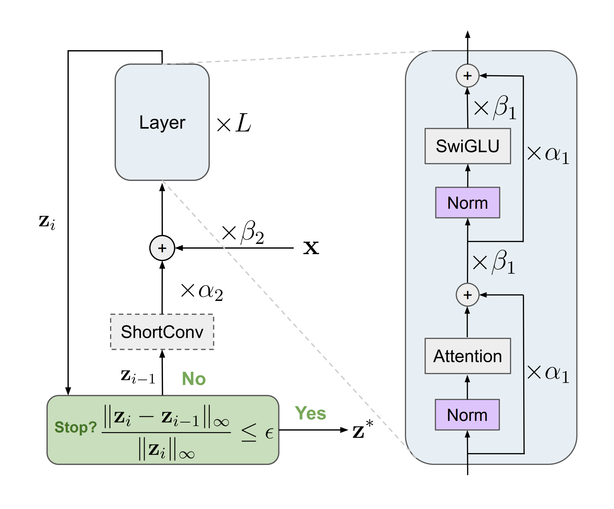

# Models

  
   
  <em>FPRM architecture. Our fixed-point Looped Transformer uses pre-norm and residual scaling for improved signal propagation.</em>

**FPRM** (Fixed-Point Reasoning Model) is a non-hierarchical looped Transformer: it repeatedly applies a single recurrent block toward a fixed point and halts adaptively once the iteration converges. The hierarchical baselines (TRM, HRM) live alongside it for comparison. Every model is wrapped by the `ACTLossHead` in `losses.py`, which adds the loss and halting logic.

## Where things live

| Path | What it is |
| --- | --- |
| `fixed_point_reasoning/fprm.py` | **FPRM** model — `FixedPointReasoningModel_ACTV1` (the paper's model) |
| `fixed_point_reasoning/fprm_config.py` | `FPRMConfig` — FPRM hyperparameters (extends `ReasoningModelConfig`) |
| `fixed_point_reasoning/model_utils.py` | `FixedPointOptimizer` (the fixed-point solver) + variational dropout |
| `recursive_reasoning/trm*.py` | TRM (Tiny Recursive Model) baselines |
| `recursive_reasoning/hrm.py` | HRM (Hierarchical Reasoning Model) baseline |
| `recursive_reasoning/transformers_baseline.py` | non-recursive transformer ablation (`Model_ACTV2`) |
| `transformer.py` | `FixedPointTransformer` block (attention + SwiGLU, optional conv / residual scaling) |
| `layers.py` | attention, SwiGLU, RoPE, RMSNorm, casted / spectral-norm linears |
| `config.py` | `ReasoningModelConfig` — shared config base for all archs |
| `losses.py` | `ACTLossHead` — loss + halting; wraps every model |
| `sparse_embedding.py` | per-puzzle sparse embeddings (`CastedSparseEmbedding`) |
| `common.py`, `ema.py` | init helpers; EMA helper |

## Architectures

Pick one with `arch=<name>` (each maps to `config/arch/<name>.yaml`):

| `arch=` | Class | Notes |
| --- | --- | --- |
| `fprm` | `FixedPointReasoningModel_ACTV1` | **The paper's model** — fixed-point looped Transformer |
| `trm` | `TinyRecursiveReasoningModel_ACTV1` | TRM baseline |
| `trm_singlez` | `TinyRecursiveReasoningModel_ACTV1` | TRM variant — single latent state |
| `trm_hier6` | `TinyRecursiveReasoningModel_ACTV1` | TRM variant — 6-level latent hierarchy |
| `hrm` | `HierarchicalReasoningModel_ACTV1` | HRM baseline |
| `transformers_baseline` | `Model_ACTV2` | non-recursive transformer ablation (H/L recursion removed, ACT kept) |

`transformers_baseline` not to be confused with Looped Transformer in the paper.

## Key config options (FPRM)

Defaults live in `config/arch/fprm.yaml`; override under `arch:` in a config or as `arch.<field>=…` on the CLI.

| Field | Meaning |
| --- | --- |
| `max_iter`, `max_iter_dist` | training fixed-point budget (`det` = fixed `max_iter`; `gamma` / `expon` sample it per step) |
| `max_iter_eval` | iteration cap at eval / for test-time scaling |
| `n_backwards_L` | number of with-grad fixed-point steps backpropagated through (activation memory ∝ this) |
| `fp_thresh`, `stepsize`, `stepsize_decay`, `decay_patience` | fixed-point solver — convergence threshold + adaptive step size for halting |
| `init_std` | std of the fixed-point iterate's initialization |
| `residual_scale`, `alpha_1_init`, `alpha_2_init` | residual scaling (signal propagation) |
| `norm_type`, `norm_placement` | normalization scheme (e.g. `pre-norm`) |
| `conv_type`, `conv_kernel_size` | optional conv over the grid (`conv2d` for Sudoku, `conv1d` for Maze) |

See the top-level [`README.md`](../README.md) for install/usage, and `config/cfg_pretrain_sudoku.yaml` / `config/cfg_pretrain_maze.yaml` for the full reproduction configs.
